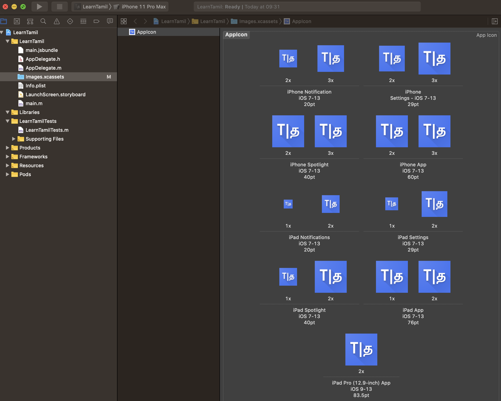
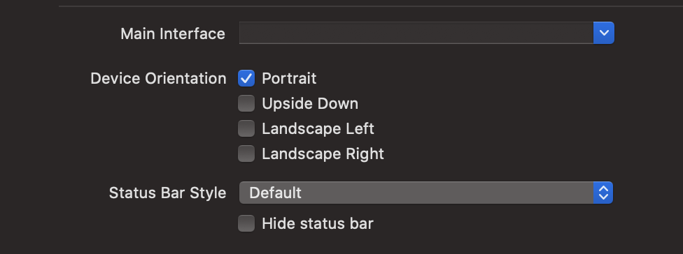

# Features

## Custom Fonts

This shows how to set up a React Native application to use custom fonts, assuming you have 
already downloaded `ttf` files from a source like [Google Fonts](https://fonts.google.com/).

[Guide](https://medium.com/@lewie9021/custom-fonts-in-react-native-85d814ca084)

* Update `react-native.config.js`, adding the following, pointing to an asset directory for your app
  with the fonts included:

```json
"assets": [
  "./assets/fonts/"
]
```

* Move your `ttf` font files to the `assets/fonts` directory.
* Run `npx react-native-asset` in the app root.

## Audio Assets

* Add audio assets to `assets/audio`. Note that file smust start with a letter and can only
contain alphanumerics and underscores.
* Update `react-native.config.js`, adding the following, pointing to the assets you just added.

```json
"assets": [
  "./assets/audio/"
]
```

* Run `npx react-native-asset` to link the files.

## FontAwesome Icons

[Guide](https://github.com/FortAwesome/react-native-fontawesome)

* Install the following packages:

```bash
npm i --save react-native-svg
npm i --save @fortawesome/fontawesome-svg-core
npm i --save @fortawesome/free-solid-svg-icons
npm i --save @fortawesome/react-native-fontawesome
```

* Construct a library on application load so you can reference FontAwesome classes easily:

```js
import { library } from '@fortawesome/fontawesome-svg-core'
import { faCheckSquare, faCoffee } from '@fortawesome/free-solid-svg-icons'

library.add(faCheckSquare, faCoffee)

// ...

<FontAwesomeIcon icon="check-square" />
```

## Navigation

[Guide](https://reactnavigation.org/docs/getting-started)

* Install packages and prerequisites:

```bash
npm install @react-navigation/native
npm install react-native-reanimated react-native-gesture-handler react-native-screens react-native-safe-area-context @react-native-community/masked-view
npm install @react-navigation/stack
```

* Add `import 'react-native-gesture-handler';` to the top of your entry file.
* Wrap your application in `NavigationContainer`:

```js
import { NavigationContainer } from '@react-navigation/native';

// ...

const App = () => {
  return (
    <NavigationContainer>
      <App />
    </NavigationContainer>
  )
}
```

* Use `createStackNavigator` to create a navigation tree of screens. Use `screenOptions` to customise the header component and page transitions.

```js
export default class NavStack extends Component {
  render() {
    return (
      <Stack.Navigator
        initialRouteName={homePage}
        screenOptions={{
          header: customHeader,
          cardStyleInterpolator: transitions.slide,
        }}
      >
        <Stack.Screen name="Home" component={Home} options={{headerTitle: 'Learning Tamil'}}/>
        <Stack.Screen name="Category" component={Category} />
      </Stack.Navigator>
    )
  }
}
```

## App Icon

### Android

It is highly recommended to use the [Android Image Asset Studio](https://developer.android.com/studio/write/image-asset-studio)
to create [adaptive icons](https://developer.android.com/guide/practices/ui_guidelines/icon_design_adaptive) which are both
animated and will scale and shape to any device/image format.

* Open Android Studio
* Right click `app/res` and select **New > Image Asset**.
* This will ask you to select foreground and background images. You can use 512x512 PNG images for the foreground and it will
  scale accordingly.
* The wizard will then create all the launcher icons required as well as the configuration for adaptive icons.
* The Play Store Icon (`ic_launcher-playstore.png`) is a 512x512 PNG that can be used to generate iOS icons.

### iOS

For iOS you can use [Icon Set Creator](https://apps.apple.com/us/app/icon-set-creator/id939343785) for Mac, which will
accept a large image (you can use the 512x512 image that Android Asset Studio produces) and output a directory with all
the relevant iOS icon sizes. To configure in your iOS app:

* Open XCode and your ios app project (`<AppName>/ios`).
* In the left pane, navigate to `<AppName>/<AppName>/images.xcassets`.
* Click on `AppIcon` in the middle panel.
* Drag all of the image files from Finder into the icon layout view in XCode. E.g.



## Theming Components

To use theming in a Cerebral Cereal app, you need to wrap your `App` in the `ThemeProvider` and then refer to the theme
context to dynamically access colours. If you do not wrap your app in the theme provider, the components will still render,
using the default theme defined in `Common/src/contexts/themeContext.js`. The theme styles themselves are defined in
`Common/src/styles/Themes.js`.

You can use the Common Component class which has a method, `getTheme`, defined that will fetch the current theme at any
moment. This will allow you to dynamically theme your applications.

E.g.

```js
// In App.js
import { ThemeProvider } from 'cerebral-cereal-common';

// ...

const App = () => {
  return (
    <Provider store={store}>
      <ThemeProvider>
        <NavigationContainer>
          <NavStack />
        </NavigationContainer>
      </ThemeProvider>
    </Provider>
  )
};

// In components
import { Component } from 'cerebral-cereal-common';

// ...

export default class Button extends Component {
  static contextType = ThemeContext;

  // ...

  render() {
    const { Colours, Fonts, Styles } = this.getTheme();
  
    // Default prop values
    const colour = props.colour || Colours.primary;
    const fontColour = props.fontColour || Colours.foreground;
    const disabledColour = props.disabledColour || Colours.offGrey;
  }
```


## Lock Orientation

[Guide](https://medium.com/react-native-training/react-native-portrait-device-orientation-9bcdeeac0b03)

### iOS

* Open XCode.
* In general settings, check only the orientations you want to allow:



### Android

* Open `android/app/src/main/AndroidManifest.xml`.
* Add `android:screenOrientation=”portrait”` to the activity, e.g:

```xml
<manifest xmlns:android="http://schemas.android.com/apk/res/android"
  package="com.learntamil">

    ...
    
      <activity
        ...
        android:screenOrientation="portrait"
        android:windowSoftInputMode="adjustResize">
        <intent-filter>
            <action android:name="android.intent.action.MAIN" />
            <category android:name="android.intent.category.LAUNCHER" />
        </intent-filter>
      </activity>
    ...

</manifest>
```


## Notifications

Choosing to use [React Native Push Notifications by zo0r](https://github.com/zo0r/react-native-push-notification).
This has the most flexible API.

* `react-native install react-native-push-notification --save`
* `react-native install @react-native-community/push-notification-ios --save`

### Local Notifications

#### Android

* Edit `android/app/main/AndroidManifest.xml` and add:

```xml
...
<uses-permission android:name="android.permission.VIBRATE" />
<uses-permission android:name="android.permission.RECEIVE_BOOT_COMPLETED"/>

<application ...>
  <meta-data  android:name="com.dieam.reactnativepushnotification.notification_color"
              android:resource="@color/blueCrayola"/>

  <receiver android:name="com.dieam.reactnativepushnotification.modules.RNPushNotificationActions" />
  <receiver android:name="com.dieam.reactnativepushnotification.modules.RNPushNotificationPublisher" />
  <receiver android:name="com.dieam.reactnativepushnotification.modules.RNPushNotificationBootEventReceiver">
      <intent-filter>
          <action android:name="android.intent.action.BOOT_COMPLETED" />
          <action android:name="android.intent.action.QUICKBOOT_POWERON" />
          <action android:name="com.htc.intent.action.QUICKBOOT_POWERON"/>
      </intent-filter>
  </receiver>
...
```

* Edit/create `android/app/src/main/res/values/colors.xml`:

```xml
<resources>
    <color name="blueCrayola">#4772F3</color>
</resources>
```

#### iOS

This uses [push-notification-ios](https://github.com/react-native-community/push-notification-ios) directly, and so
the setup is identical.

#### React Native

The best way to use the library is to follow the example and set up:

* A [`NotifService`](https://github.com/zo0r/react-native-push-notification/blob/master/example/NotifService.js)
* A [`NotifHandler`](https://github.com/zo0r/react-native-push-notification/blob/master/example/NotificationHandler.js)

Then in your React component you can import the service and start using the methods:

```js
import NotifService from '../../services/NotifService';

class MyComponent extends Component {
  constructor (props) {
    super(props);
    this.notif = new NotifService(
      this.onRegister.bind(this),
      this.onNotif.bind(this),
    );
  }

  notify = () => {
    this.notif.localNotif('Sending a Notif', 'Notif Message');
  }
```

